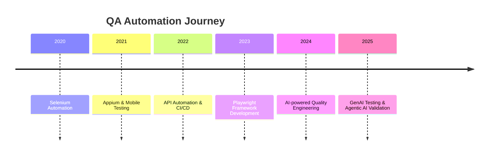

# Hi 👋, I'm **Mamidi Deepthi**

<div align="center">

### 🚀 Senior QA Automation Engineer | Playwright | Selenium | API Testing | Appium | AI-Powered Quality Engineering


Building reliable software through intelligent automation, scalable frameworks, AI-driven quality engineering, and continuous delivery.

<p>

</p>

</div>

---

# 👩‍💻 About Me

I'm a **Senior QA Automation Engineer** with **7+ years of IT experience**, including **5+ years in Software Testing**, specializing in enterprise Healthcare and Insurance applications.

- 🎯 Playwright | Selenium | Appium
- 🌐 API Testing (REST Assured & Postman)
- 🤖 AI & GenAI Testing
- ☁ Azure DevOps | Jenkins | Git
- 📱 Web & Mobile Automation
- 🚀 CI/CD & Quality Engineering

---

# 🎯 Career Timeline

```text
2020  Software Test Engineer → Xenops Technologies
2021  Senior Client Partner (QA) → Access Healthcare
2023  Senior Analyst (QA) → R1 RCM Global
2026+ AI Quality Engineering | Agentic AI | LLM Evaluation
```

---

# 📈 Professional Journey



---

# 🏢 Companies I've Worked With


---

# 🛠 Tech Stack

### Languages


### Automation
- Playwright
- Selenium WebDriver
- TestNG
- Cucumber
- Appium
- Page Object Model
- Hybrid Framework

### API
- REST Assured
- Postman
- JSON/XML Validation

### DevOps


### Cloud
Azure • AWS • Azure DevOps

---

# 🌟 Automation Framework Showcase

| Framework | Description |
|-----------|-------------|
| 🎭 Playwright | POM, Parallel Execution, API Testing |
| 🧪 Selenium | Java + TestNG Hybrid Framework |
| 📱 Appium | Android & iOS Automation |
| 🌐 REST Assured | API Automation Framework |
| 🤖 AI Testing | Prompt, LLM, RAG & Hallucination Validation |

---

# 📊 Skills

```text
Playwright         ████████████████████ 95%
Selenium           ███████████████████ 92%
API Testing        ██████████████████  90%
Appium             █████████████████   85%
Java               ██████████████████  90%
JavaScript         █████████████████   88%
SQL                ████████████████    87%
CI/CD              ███████████████     82%
AI Testing         ██████████████████  90%
```

---

# 🤖 AI & GenAI Testing Expertise

- Prompt Validation
- LLM Evaluation
- Hallucination Detection
- Agentic AI Workflow Testing
- RAG Validation
- Context & Memory Testing
- Tool Invocation Validation
- AI Regression Testing
- Autonomous Test Execution
- Response Quality Evaluation

---

# 💼 Professional Experience

## 🏥 R1 RCM Global Pvt Ltd
**Senior Analyst – QA Testing** *(Jan 2023 – Dec 2025)*

- Built scalable Playwright automation frameworks.
- Designed Page Object Model architecture.
- Automated smoke, sanity, regression and E2E suites.
- API automation and cross-browser testing.
- Integrated CI/CD using Jenkins and Azure DevOps.
- AI-assisted quality engineering and defect analysis.

### Projects
- Revenue Cycle Management (Ascension Health)

---

## 💳 Access Healthcare Pvt Ltd
**Senior Client Partner – QA Testing** *(Oct 2021 – Jan 2023)*

- Enterprise Playwright automation.
- Claims Processing System (Cigna).
- API validation and reporting.
- Cross-browser automation.
- CI/CD integration.

---

## 🧪 Xenops Technologies
**Software Test Engineer** *(Jan 2020 – May 2021)*

- Selenium WebDriver with Java.
- Appium mobile automation.
- SQL database validation.
- Functional and regression testing.

### Major Projects

#### 🏥 Revenue Cycle Management
Playwright • JavaScript • Azure DevOps • Jenkins

#### 💳 Claims Processing System
Playwright • API Testing • HTML & Allure Reporting

#### 🏥 TriMedx Medical Platform
Selenium • Java • Appium • SQL

#### 👨‍👩‍👧 SACWIS
Mobile Automation • Android • iOS • Appium

#### 🌍 Labour Planning
REST Assured • API Testing • SQL

---

# 🏆 Achievements

- 🏅 Spot Team Award – 2025
- 🏅 Best Employee Award – 2022

---

# 📚 Currently Learning

- Advanced Playwright
- Azure AI
- Agentic AI
- LLM Evaluation
- Prompt Engineering
- Kubernetes for Test Automation

---

# 💻 Coding Profiles

- GitHub: https://github.com/deepthimamidi
---

# 📫 Contact

- 📧 Email: Deepthymamidi@gmail.com
- 🐙 GitHub: https://github.com/deepthimamidi

---

<div align="center">

## ⭐ *"Quality is never an accident. It is always the result of intelligent effort."*

**Thanks for visiting my profile!**

If you like my work, consider ⭐ starring my repositories.

</div>

